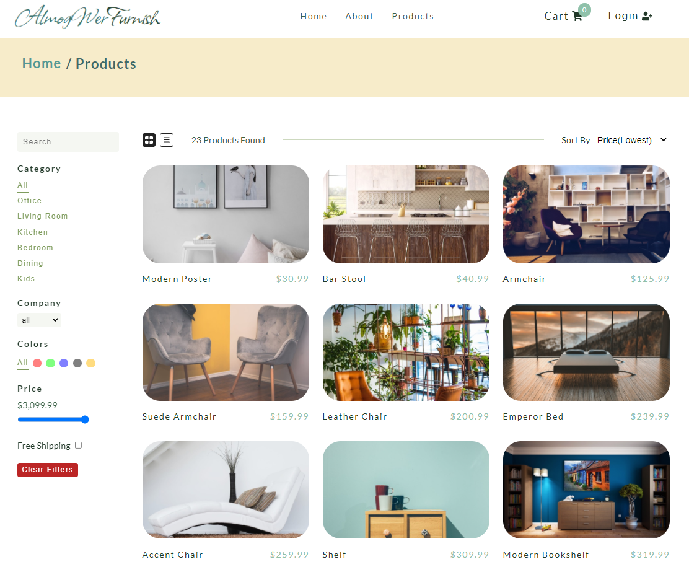
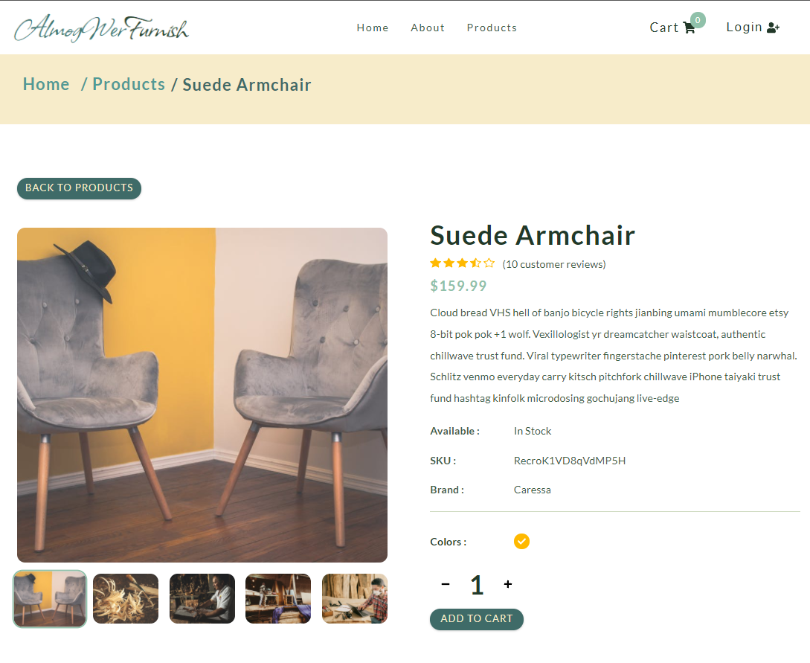

<h1 align="center">Furniture E-Commerce</h1>

## Project Description

React front-end full operating dynamic and responsive E-Commerce shop including payment connection (stripe)

Welcome to the furniture website, built using the latest technologies including React, HTML, and CSS. I have integrated a furniture API to provide a wide selection of high-quality furniture pieces for you to choose from. Our checkout process is secure and seamless thanks to the integration of Stripe. Shop with confidence and find the perfect piece to furnish your space. 

## Built with

- HTML
- CSS
- React

# npm-start


## Links

- [Repo](https://github.com/yonatankumsa/furniture-e-commerce "Furniture E-commerce Repo")
- [Live](https://almogwer-furniture-ecommerce.netlify.app/ "Live View")


## Screenshots & Animation





## Author

- [Yonatan Kumsa](https://github.com/almogwer)
- [Linkedin](https://www.linkedin.com/in/yonatan-kumsa/)

## React Version

```
"react": "^17.0.1",
"react-dom": "^17.0.1",
"react-scripts": "4.0.0",
```

- [react-router-dom - Main Docs](https://reactrouter.com/web/guides/quick-start)

## Furniture API

- [Get Single Product](https://course-api.com/react-store-single-product?id=)
- [Get Products](https://course-api.com/react-store-products)

## Stripe

- [Stripe - Main Docs](https://stripe.com/docs/payments?payments=popular)
- [Stripe - React ](https://stripe.com/docs/stripe-js/react)

## Deployment

[Netlify](https://www.netlify.com/)


